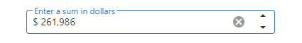

<!-- default badges list -->

<!-- default badges end -->
# DevExtreme NumberBox - Getting Started 

This repository stores the code examples of the NumberBox component for the [Getting Started with NumberBox](https://js.devexpress.com/Documentation/Guide/UI_Components/NumberBox/Getting_Started_with_NumberBox/) tutorial. The component allows users to enter a value and increment or decrement it with the spin buttons, keyboard, or mouse wheel.

## Files to Review

- **Angular**
    - [app.component.html](Angular/src/app/app.component.html)
    - [app.component.ts](Angular/src/app/app.component.ts)
- **jQuery**
    - [index.js](jQuery/src/index.js)
- **React**
    - [App.tsx](React/src/App.tsx)
- **Vue**
    - [App.vue](Vue/src/App.vue)
    - [NumberBoxContent.vue](Vue/src/components/NumberBoxContent.vue)

## Documentation

- [Getting Started with NumberBox](https://js.devexpress.com/Documentation/Guide/UI_Components/NumberBox/Getting_Started_with_NumberBox/)

- [NumberBox - API Reference](https://js.devexpress.com/Documentation/ApiReference/UI_Components/dxNumberBox/)
<!-- feedback -->
## Does This Example Address Your Development Requirements/Objectives?

 

(you will be redirected to DevExpress.com to submit your response)
<!-- feedback end -->
