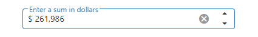

# DevExtreme jQuery NumberBox - Getting Started 

This repository stores the source code examples for the jQuery NumberBox UI component that displays a numeric value and allows a user to modify it by typing in a value, incrementing or decrementing it using the spin buttons, keyboard or mouse. Read more in the [Getting Started with NumberBox](https://js.devexpress.com/Documentation/Guide/UI_Components/NumberBox/Getting_Started_with_NumberBox/) tutorial.

<div align="center"></div>

## Installation

Download the example and use NPM to install required libraries.

```
npm install
```

## Development server

Run the `npm run start` command to run the development server. Use the following link to check the example:
```
http://localhost:3000/src/index.html
```

## Further help

You can learn more about jQuery API in the [jQuery documentation](https://api.jquery.com/).

To get more help on DevExtreme submit an issue on [GitHub](https://github.com/DevExpress/devextreme/issues) or [Support Center](https://www.devexpress.com/Support/Center/Question/Create)


